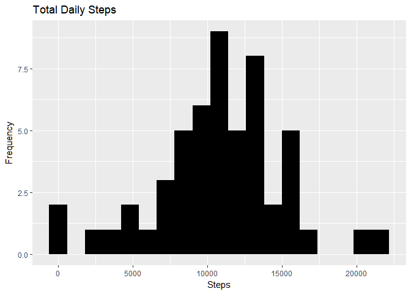
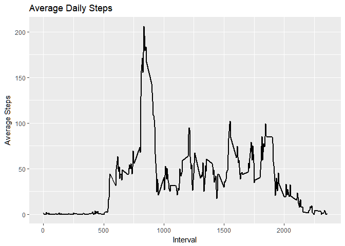
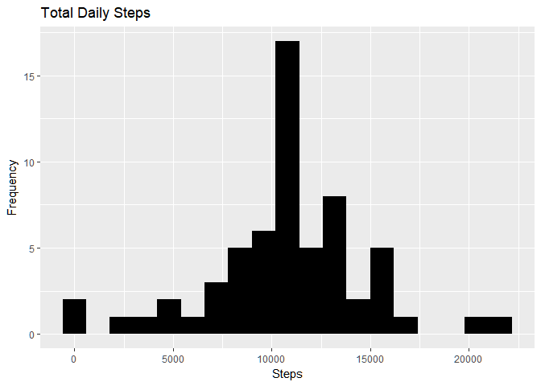
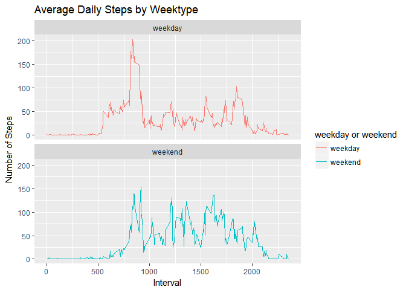

# Reproducible Research: Peer Assessment 1
## Loading and preprocessing the data
### Load the libraries

```r
library("data.table")
library(ggplot2)
```
### Download the file

```r
file_URL <- "https://d396qusza40orc.cloudfront.net/repdata%2Fdata%2Factivity.zip"
download.file(file_URL, destfile = "activity.zip")
unzip("activity.zip")
```
### Read the csv file into Data.Table

```r
Activity_Data <- fread("activity.csv")
Activity_Data$date <- as.Date(Activity_Data$date, "%Y-%m-%d")
```
## What is the mean total number of steps taken per day?
### Histogram of the total number of steps taken each day

```r
Total_Daily_Steps <- Activity_Data[, .(steps = sum(steps, na.rm = FALSE)), by = date]
ggplot(Total_Daily_Steps, aes(x = steps)) + geom_histogram(fill = "black", binwidth = 1200) + labs(title = "Total Daily Steps", x = "Steps", y = "Frequency")
```

```
## Warning: Removed 8 rows containing non-finite values (stat_bin).
```

<!-- -->

### Mean and median number of steps taken each day

```r
Total_Daily_Steps[, .(Mean_Step = mean(steps, na.rm = TRUE), Median_Step = median(steps, na.rm = TRUE))]
```

```
##    Mean_Step Median_Step
## 1:  10766.19       10765
```
## What is the average daily activity pattern?

```r
Average_Interval_Steps <- Activity_Data[, c(lapply(.SD, mean, na.rm = TRUE)), .SDcols = c("steps"), by = .(interval)]  
ggplot(Average_Interval_Steps, aes(x = interval , y = steps)) + geom_line(color="black", size=1) + labs(title = "Average Daily Steps", x = "Interval", y = "Average Steps")
```

<!-- -->

### Which 5-minute interval, on average across all the days in the dataset, contains the maximum number of steps?

```r
Average_Interval_Steps[steps == max(steps), .(max_interval = interval)]
```

```
##    max_interval
## 1:          835
```
## Imputing missing values
### Calculate and report the total number of missing values in the dataset (i.e. the total number of rows with NAs)

```r
Activity_Data[is.na(steps), .N ]
```

```
## [1] 2304
```
### Devise a strategy for filling in all of the missing values in the dataset. The strategy does not need to be sophisticated. For example, you could use the mean/median for that day, or the mean for that 5-minute interval, etc.
### Filling in the missing values with the mean 

```r
Activity_Data[is.na(steps), "steps"] <- Activity_Data[, .(mean(steps, na.rm = TRUE))]
```

```
## Warning in `[<-.data.table`(`*tmp*`, is.na(steps), "steps", value =
## structure(list(: Coerced 'double' RHS to 'integer' to match the column's
## type; may have truncated precision. Either change the target column to
## 'double' first (by creating a new 'double' vector length 17568 (nrows of
## entire table) and assign that; i.e. 'replace' column), or coerce RHS to
## 'integer' (e.g. 1L, NA_[real|integer]_, as.*, etc) to make your intent
## clear and for speed. Or, set the column type correctly up front when you
## create the table and stick to it, please.
```
### Create a new dataset that is equal to the original dataset but with the missing data filled in.

```r
fwrite(x = Activity_Data, file = "activity_clean.csv", quote = FALSE)
```
### Make a histogram of the total number of steps taken each day and Calculate and report the mean and median total number of steps taken per day. Do these values differ from the estimates from the first part of the assignment? What is the impact of imputing missing data on the estimates of the total daily number of steps?

```r
Total_Daily_Steps <- Activity_Data[, .(steps = sum(steps, na.rm = FALSE)), by = date]
Total_Daily_Steps[, .(Mean_Step = mean(steps), Median_Step = median(steps))]
```

```
##    Mean_Step Median_Step
## 1:  10751.74       10656
```

```r
ggplot(Total_Daily_Steps, aes(x = steps)) + geom_histogram(fill = "black", binwidth = 1200) + labs(title = "Total Daily Steps", x = "Steps", y = "Frequency")
```

<!-- -->

## Are there differences in activity patterns between weekdays and weekends?

Estimate with NA | Estimate with NA filled
---------------- | -----------------------
Mean = 10766     | Mean = 10752
Median = 10765   | Median = 10656 

## For this part the weekdays() function may be of some help here. Use the dataset with the filled-in missing values for this part.
### Create a new factor variable in the dataset with two levels - "weekday" and "weekend" indicating whether a given date is a weekday or weekend day.

```r
Activity_Data <- fread("activity.csv")
Activity_Data[, date := as.POSIXct(date, format = "%Y-%m-%d")]
Activity_Data[, `Day of Week`:= weekdays(x = date)]
Activity_Data[grepl(pattern = "Monday|Tuesday|Wednesday|Thursday|Friday", x = `Day of Week`), "weekday or weekend"] <- "weekday"
Activity_Data[grepl(pattern = "Saturday|Sunday", x = `Day of Week`), "weekday or weekend"] <- "weekend"
Activity_Data[, `weekday or weekend` := as.factor(`weekday or weekend`)]
head(Activity_Data, 10)
```

```
##     steps       date interval Day of Week weekday or weekend
##  1:    NA 2012-10-01        0      Monday            weekday
##  2:    NA 2012-10-01        5      Monday            weekday
##  3:    NA 2012-10-01       10      Monday            weekday
##  4:    NA 2012-10-01       15      Monday            weekday
##  5:    NA 2012-10-01       20      Monday            weekday
##  6:    NA 2012-10-01       25      Monday            weekday
##  7:    NA 2012-10-01       30      Monday            weekday
##  8:    NA 2012-10-01       35      Monday            weekday
##  9:    NA 2012-10-01       40      Monday            weekday
## 10:    NA 2012-10-01       45      Monday            weekday
```
### Make a panel plot containing a time series plot (i.e. type = "l") of the 5-minute interval (x-axis) and the average number of steps taken, averaged across all weekday days or weekend days (y-axis). See the README file in the GitHub repository to see an example of what this plot should look like using simulated data.

```r
Activity_Data[is.na(steps), "steps"] <- Activity_Data[, c(lapply(.SD, median, na.rm = TRUE)), .SDcols = c("steps")]
Average_Interval_Steps <- Activity_Data[, c(lapply(.SD, mean, na.rm = TRUE)), .SDcols = c("steps"), by = .(interval, `weekday or weekend`)] 

ggplot(Average_Interval_Steps , aes(x = interval , y = steps, color=`weekday or weekend`)) + geom_line() + labs(title = "Average Daily Steps by Weektype", x = "Interval", y = "Number of Steps") + facet_wrap(~`weekday or weekend` , ncol = 1, nrow=2)
```

<!-- -->


